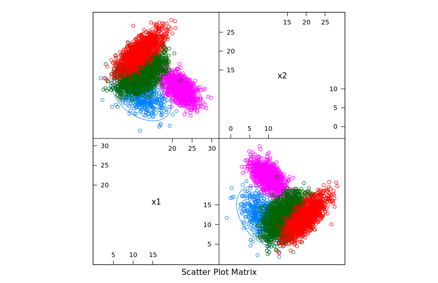

# A2

## Q1

| Model | Train/Test | Error |
| --- | --- | --- |
| 1 | Train | 0.468 |
| 1 | Test | 0.516 |
| 2 | Train | 0.216 |
| 2 | Test | 0.224 |
| 3 | Train | 0.096 |
| 3 | Test | 0.127 |
| 4 | Train | 0.05 |
| 4 | Test | 0.0665 |

Model 4 is best at making predictions because it has the smallest test error.

## Q2

| Model | Train/Test | Error |
| --- | --- | --- |
| 1 | Train | 0.334 |
| 1 | Test | 0.3305 |
| 2 | Train | 0.334 |
| 2 | Test | 0.3305 |
| 3 | Train | 0.32 |
| 3 | Test | 0.35 |
| 4 | Train | 0.08 |
| 4 | Test | 0.111 |

Model 4 is best at making predictions because it has the smallest test error.

## Q3

| Model | Bias | Variance | MSE |
| --- | --- | --- | --- |
| 1 | 0.04901667 | 0.00840924 | 0.05742591 |
| 2 | 5.530704e-05 | 0.008471189 | 0.008526496 |
| 3 | 0.0007167326 | 0.02291368 | 0.02363041 |

Model 2 is best at making predictions because it has the smallest MSE. As a sanity check, it is also the closest to the ground truth model we used, so this makes sense.

## Q4

| k | Train Error | Test Error |
| --- | --- | --- |
| 1 	| 0.4818763 	| 0.18 |
| 3 	| 0.4840085 	| 0.14 |
| 5 	| 0.4754797 	| 0.13 |
| 7 	| 0.4754797 	| 0.13 |
| 9 	| 0.4754797 	| 0.14 |
| 11 	| 0.4733475 	| 0.14 |
| 13 	| 0.4712154 	| 0.14 |
| 15 	| 0.4712154 	| 0.15 |
| 17 	| 0.4712154 	| 0.14 |
| 19 	| 0.4733475 	| 0.14 |
| 21 	| 0.4733475 	| 0.14 |
| 23 	| 0.4712154 	| 0.14 |
| 25 	| 0.4733475 	| 0.14 |
| 27 	| 0.4712154 	| 0.14 |
| 29 	| 0.4712154 	| 0.14 |
| 31 	| 0.4733475 	| 0.14 |
| 33 	| 0.4733475 	| 0.14 |
| 35 	| 0.4733475 	| 0.14 |
| 37 	| 0.4733475 	| 0.15 |
| 39 	| 0.4712154 	| 0.15 |
| 41 	| 0.4712154 	| 0.15 |
| 43 	| 0.4690832 	| 0.15 |
| 45 	| 0.4712154 	| 0.16 |
| 47 	| 0.4712154 	| 0.16 |
| 49 	| 0.4690832 	| 0.16 |
| 51 	| 0.4690832 	| 0.16 |

Models `k = 5` and `k = 7` performed best as they had the lowest test error/=. 

| Cut-Off | Sensitivity | Specificity | Accuracy |
| --- | --- | --- | --- |
| 0.1 | 0.950 | 0.800 | 0.86 |
| 0.5 | 0.8250 | 0.9667 | 0.91 |
| 0.9 | 0.5750 | 0.9833 | 0.82 |

Model 2 (cut-off = 0.5) performed the best as it had the highest accuracy and a very low false negative rate.

## Q5

Train Data Pair Plots:

| Model | Train Error | Test Error |
| --- | --- | --- |
| ALR | 0.1482222 | 0.17425 |
| LDA (est) | 0.162 | 0.19825 |
| LDA (flt) | 0.1906667 | 0.16875 |
| QDA (est) | 1 | 0.16925 |
| QDA (flt) | 0.1791111 | 0.14 |
| Bayes | 0.1733333 | 0.2 |

Model QDA (flat) is the best model as it has the smallest test error.
