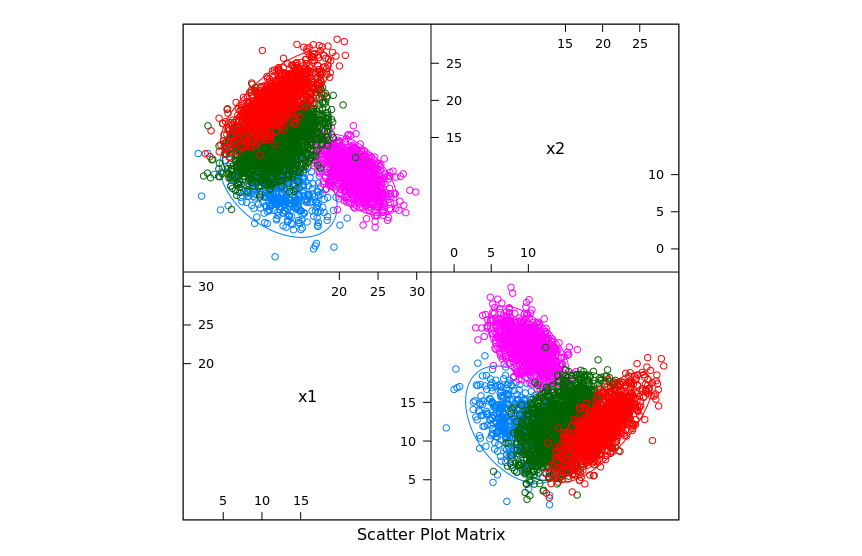

## Q5

Train Data Pair Plots:

| Model | Train Error | Test Error |
| --- | --- | --- |
| ALR | 0.1482222 | 0.17425 |
| LDA (est) | 0.162 | 0.19825 |
| LDA (flt) | 0.1906667 | 0.16875 |
| QDA (est) | 1 | 0.16925 |
| QDA (flt) | 0.1791111 | 0.14 |
| Bayes | 0.1733333 | 0.2 |

Model QDA (flat) is the best model as it has the smallest test error.
