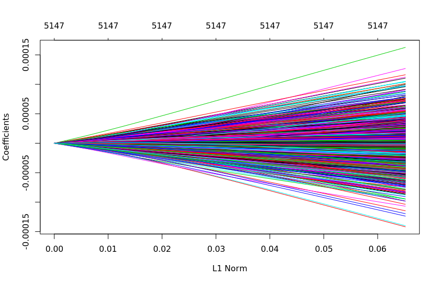
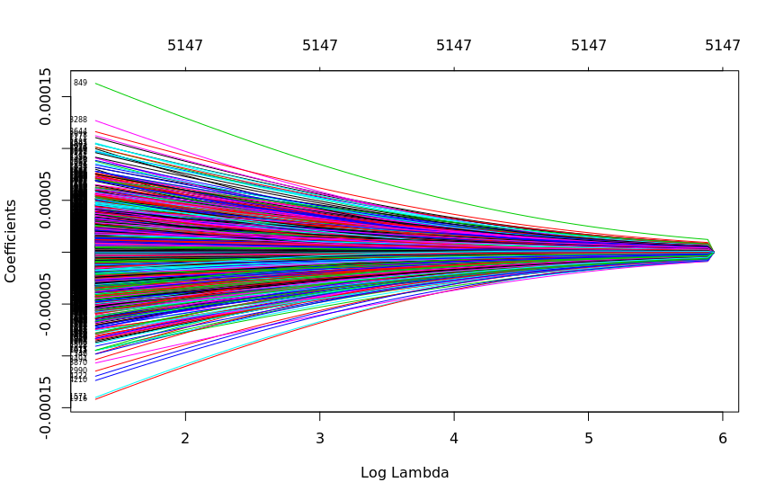
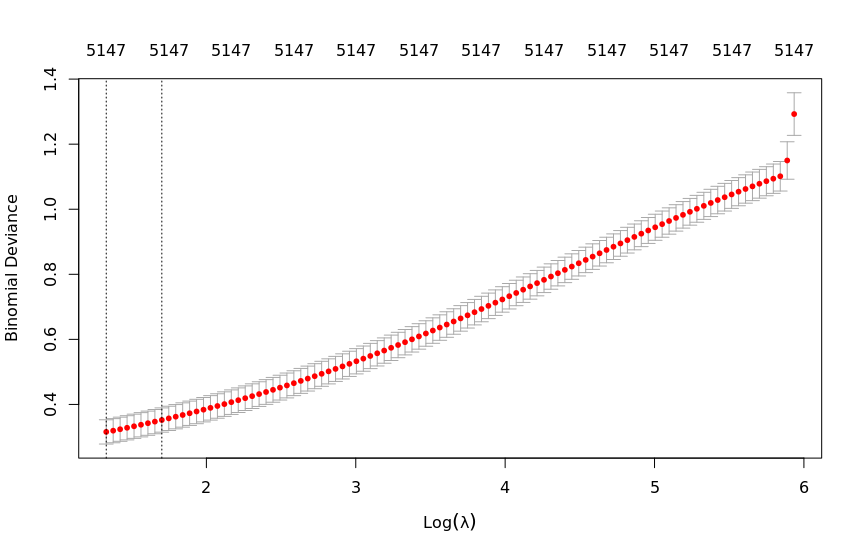
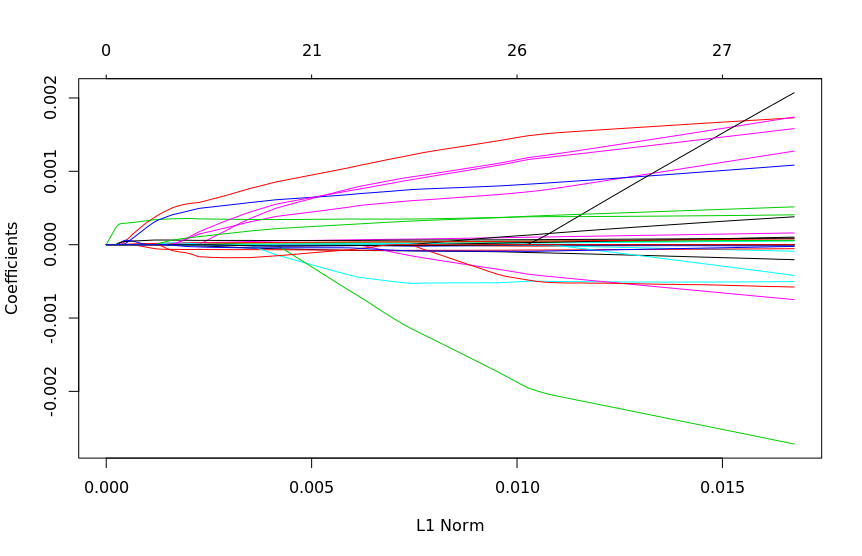
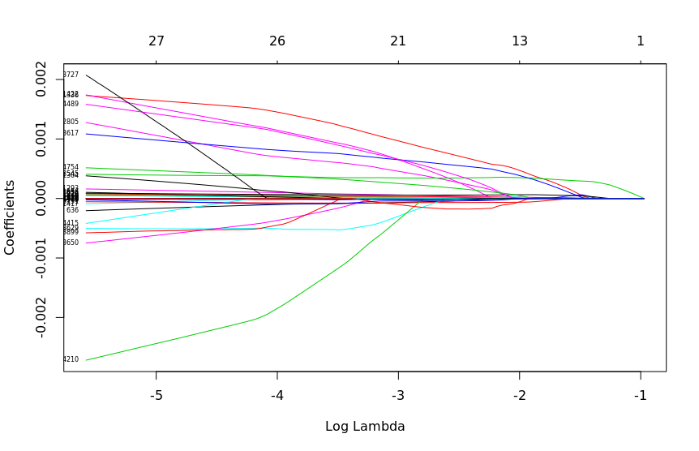
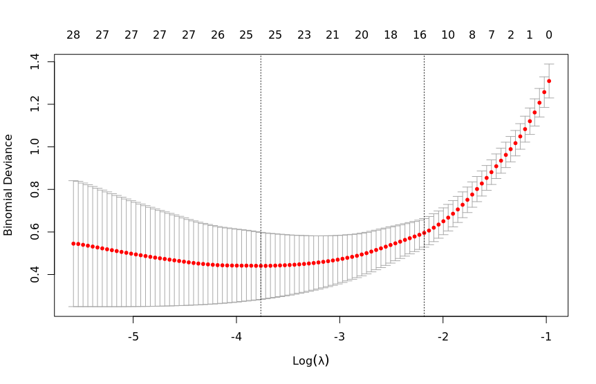

# A3

## Q1

A. N/A

B + C + D

Ridge

Lasso

E. 
| k | Accuracy | Kappa | AccuracySD | KappaSD |
|---|---|---|---|---|
| 5 | 0.8866667 | 0.7302138 | 0.08209281 | 0.2026919 |
| 7 | 0.8876190 | 0.7247902 | 0.08071393 | 0.2033764 |
| 9 | 0.8590476 | 0.6453966 | 0.10110501 | 0.2684533 |

F.

| Model | Accuracy | AccuracySD |
|---|---|---|
| Ridge 1 | 0.9733333 | 0.03651484 |
| Ridge 2 | 0.9733333 | 0.03651484 |
| Lasso 1 | 0.9180952 | 0.10928545 |
| Lasso 2 | 0.9180952 | 0.08847409 |
| `k=5` | 0.8866667 | 0.08209281 |
| `k=7` | 0.8876190 | 0.08071393 |
| `k=9` | 0.8590476 | 0.10110501 |

## Q2

| Model | RMSE |
|---|---|
| Additive Linear | 2177.782 |
| Elastic (Additive) | 2187.159 |
| Elastic (Interactions) | 2006.594 |
| KNN | 2075.144 |
| KNN (Interactions) | 2099.755 |
| KNN (Scaled) | 2097.179 |
| KNN (Interactions) (Scaled) | 2084.172 |
| Random Forest | 1871.15 |

The Random Forest approach had the lowest test RMSE, and is thus the best model.
The additive linear model is very weak, and is likely not a good fit for
this problem. The KNNs all generally did poorly suggesting there might be lots of
overlapping of the classes. The Elastic Net with interactions was the second best
model, however the elastic net with additive predictors was the worst model, which
suggests that the elastic net itself may not be a good choice, and to instead look
into lasso and ridge as well and see what those results look like.

## Q3

One possible reason why it may have been easy to find a k-NN model that met the stated criteria
(as opposed to the linear model) is that the data may be fundamentally clustered (as opposed to fundamentally
linear). This would mean that a clustering approach like nearest neighbours would more readily
find representative patterns versus what a linear model could do.

## Q4

A. Based on the results from Q1 of A2, I believe that the true decision boundaries are non-linear. 
This is because although the current model does a good job of categorizing, it still has a meaningful error component.
Since our best model uses two quadratic boundaries, we should either continue tweaking these boundaries, as we may be able
to refine them further, or conclude that the classes cannot be completely correctly classified just with linear boundaries.

B. Based on the results from Q2 of A2, the model that performs best is model 4. I believe this is a
consequence of including the interaction term between x1 and x2, as the results of the other three models are all quite
similar. Additionally, model 3 stands out as better than models 1 and 2, and includes the self interaction terms for
x1 and x2, which suggests that these are strongly predictive terms.

C. Based on the results from Q2 of A2, models 1 and 2 appear to be underfitting, because ...

D. Based on the results of Q3 from A2, the additive model (model 2) is the best performing model. This makes sense when
looking at the ground truth function, as the exponential function is monotonic and (relatively) linear in the terms
x1 and x2. Thus, using x1 and x2 without any quadratic or interaction terms is most representative of the ground truth,
so we would expect the model to be most accurate. Based on the results from the Bias Squared column of the table, models
2 and 3 appear to be performing unbiased estimation. This is likely occurring for the same reason, as the model is able to
approximate the groundtruth closely.

## Q5

A. `k=5` and `k=7` performed best in the first part of Q4 of A2. For the second part, model 2 would be
best to use because we're talking about medical results. For a screening test, we are ok with false
positives but want to minimize false negatives. This is because false positives can get filtered out
by future tests, but false negatives would immediately exit the pipeline and may not find out about their
true condition until the disease has progressed significantly.

B. In Q5 of A2, the QDA with a flat prior performs the best. A likely reason for this is that QDA uses
quadratic decision boundaries, and we note that QDA with estimated priors also performed reasonably well. Another
possible reason is that we assume features are multivariate normal conditioned on the classes.

C. Naive Bayes may perform poorly because we assume independence between the features, which may be incorrect.

D. QDA performs better than LDA. This may be the case because the underlying ground truth is quadratic rather
than linear in nature.

E. Using a flat prior performs better than estimating it from the data. We see this for both QDA and LDA. This
may be the case because the flat prior we chose is more representative of the underlying ground truth than
what the model is able to estimate based on the data.

F. The class that is easiest to classify is most likely `B`, as it stands out compared to the other classes
in the feature plots. This is most evident when they are plotted as normal distributions, but also visible
in the scatter plot matrix.

## Q6

A. There are 72 observations and 5147 predictors (the last column is the correct class).

B. No, as the there is no inflection point. We would expect the results to start deteriorating.

C. Yes, as we see an inflection point for the log lambdas.

D. KNN seems to do worse as k increases, although k=7 seems slightly better
than both k=5 and k = 9. The difference between KNN and the penalized methods
is that KNN looks for proximity in a very high dimensional space (which may be
high enough to make the distances very large/not meaningful in this case), whereas
the lasso and ridge models are better able to learn weights by penalizing 
incorrect predictions.

E. Both ridge models had not only the highest accuracy, but also the lowest
standard deviation on that accuracy, making either of them the best choice
of the models we constructed.

F. Based on my table, choosing the random forest makes the most sense as it has
the lowest RMSE. Intuitively, it also is not unreasonable (though maybe a bit
surprising) that there is no strong predictive power in the dataset (ie. the 
metrics we have in the dataset are largely context-sensitive from one university to
the next).

G. The best tuning parameters are alpha = 0.1 and alpha = 0.2 respectively. This
is very close to ridge, because ridge uses an alpha of 0 while lasso uses an
alpha of 1.

H. After trying both, the scaled approach was marginally better when considering
interactions as well, but worse otherwise. If our model was accurate at estimating
the underlying ground truth, scaling should either have no effect or a positive
effect on our predictive power, so this suggests that KNN is not the correct 
model for this data.

I. The best KNN model was the vanilla KNN. One possible explanation for this is
that it is slightly more general, and thus not overfitting the data.

J. This dataset is from 1995. The out of state tuition for the University of Illinois at Urbana-Champaign at that time was 7560.

