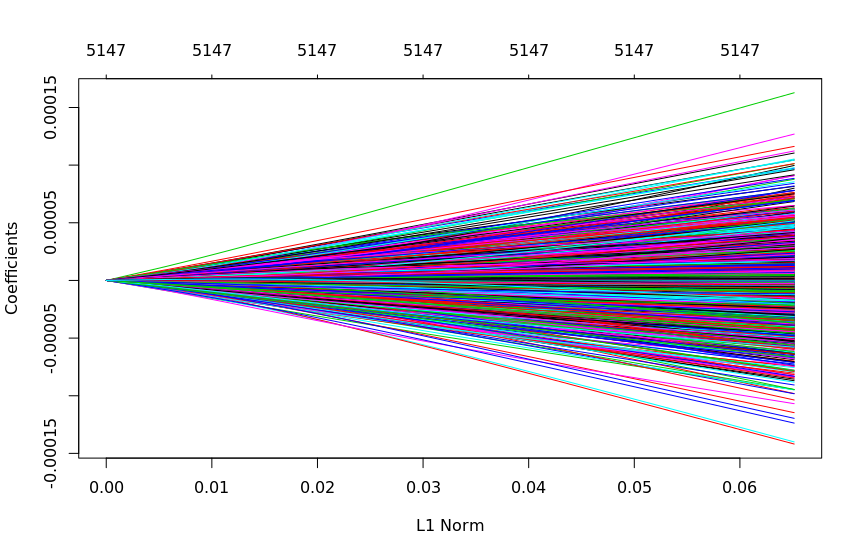
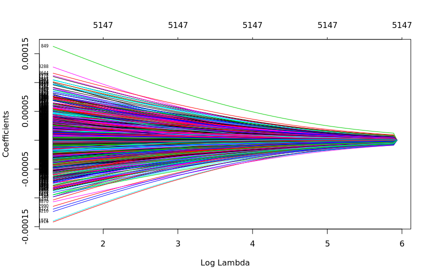
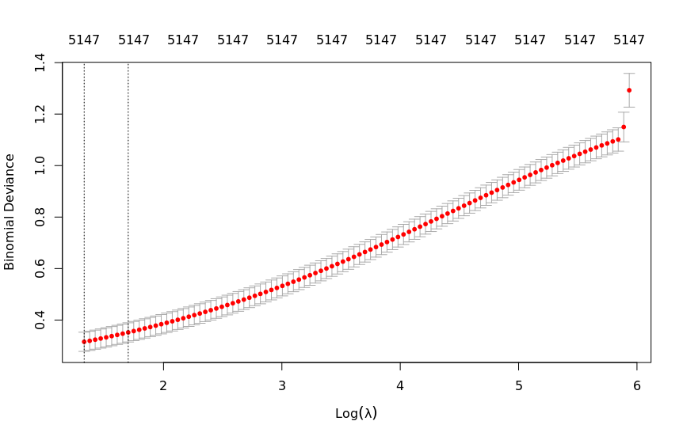
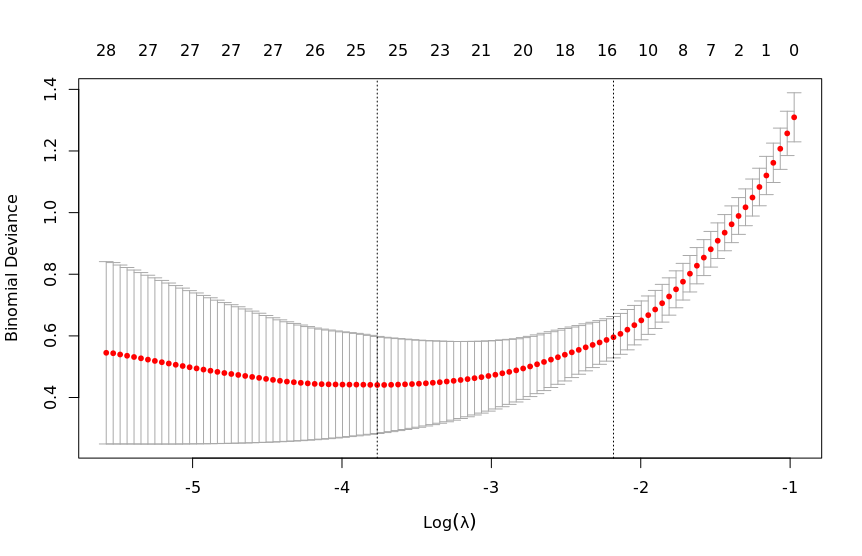

## Q1

A. N/A

B + C + D

Ridge

Lasso

E. 
| k | Accuracy | Kappa | AccuracySD | KappaSD |
|---|---|---|---|---|
| 5 | 0.8866667 | 0.7302138 | 0.08209281 | 0.2026919 |
| 7 | 0.8876190 | 0.7247902 | 0.08071393 | 0.2033764 |
| 9 | 0.8590476 | 0.6453966 | 0.10110501 | 0.2684533 |

F.

| Model | Accuracy | AccuracySD |
|---|---|---|
| Ridge 1 | 0.9733333 | 0.03651484 |
| Ridge 2 | 0.9733333 | 0.03651484 |
| Lasso 1 | 0.9180952 | 0.10928545 |
| Lasso 2 | 0.9180952 | 0.08847409 |
| `k=5` | 0.8866667 | 0.08209281 |
| `k=7` | 0.8876190 | 0.08071393 |
| `k=9` | 0.8590476 | 0.10110501 |
