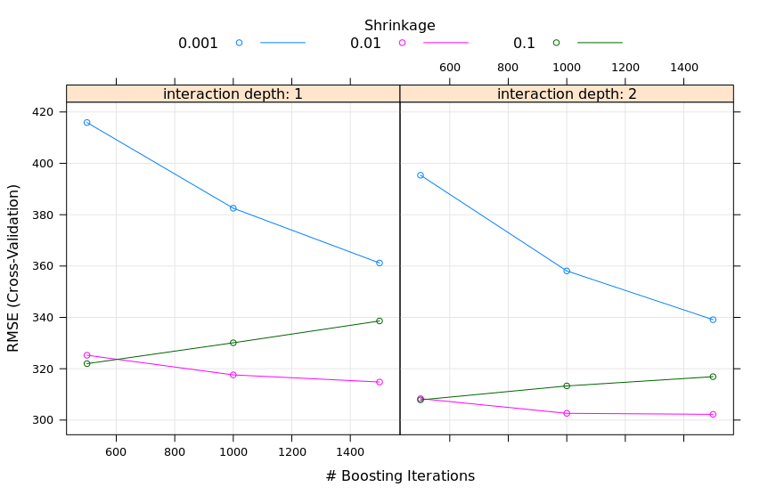
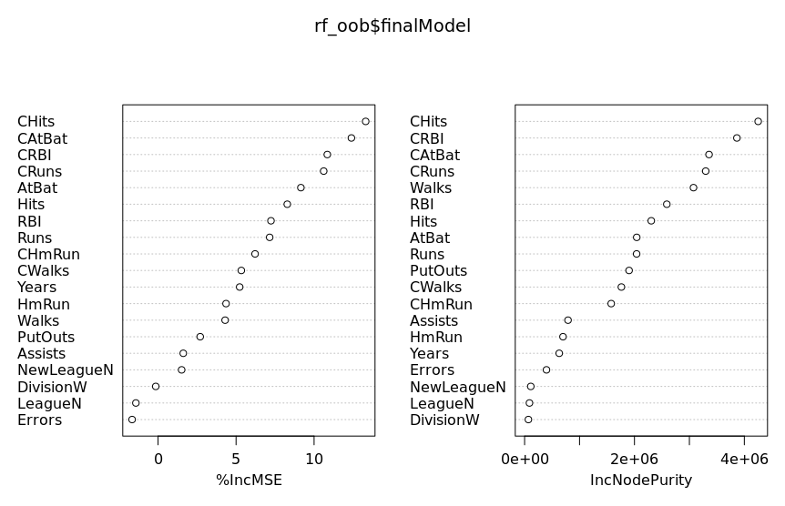
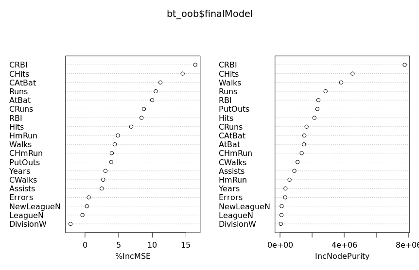

# A4

## Q1

| Model | Tuning Parameter | Time to Train | Resampled Accuracy | Test Accuracy |
|---|---|---|---|---|
| Logistic | N/A | 0.752 | 0.6612 | 0.6628 |
| Tree w/ CV | cp = 0.01733333 | 0.851 | 0.7848 | 0.6615 |
| RF w/ CV | mtry = 1 | 9.164 | 0.8464 | 0.8429 |
| RF w/ OOB | mtry = 1 | 3.486 | 0.8388 | 0.8428 |

## Q2

| Model | Resampled RMSE | Test RMSE |
|---|---|---|
| Tuned Boosted Tree | 302.2454 | 265.0661 |
| Tuned RF | 295.4505 | 256.5393 |
| Bagged Tree | 303.8031 | 257.1126 |

## Q3

| Model | Tuning Parameters | Test Accuracy |
|---|---|---|
| Linear SVM | c = 0.25 | 0.82397 |
| Polynomial SVM | degree = 1, scale = 0.1, c = 1 | 0.8314607 |
| Radial SVM | sigma = 0.125, c = 2 | 0.8314607 |
| Random Forest | mtry = 9 | 0.8183521 |

The Polynomial and Radial SVMs are tied with the highest test accuracy. All of the SVM models did better
than the Random Forest. 

## Q4

1. Yes. The cross-validation needs to train five different models whereas the
out of bag model only needs one. 

2. Yes. They both chose the model with mtry = 1.

3. Both random forest models did markedly better than the other two models. This
is reasonable because the data was in a mixed spiral shape, so we'd expect any
logistic/linear boundary to perform poorly. The cross-validated random forest did
slightly better than the out of bag one, which makes sense, because it gets to
choose the best of five trained models. 

## Q5

1. The random forest model chose an mtry value of 6.

2. Plot:

3. Plot: 

4. Plot:

5. According to the random forest model, the three most important predictors are
CHits, CAtBat, and CRBI. This makes sense because these are the "flashy" metrics
that fans are most likely to use to determine their favourite players, and the
fact that these are career-based metrics means that they naturally include
seniority, which one would expect to play a big role in salary. Hits measure
accuracy, times at bat roughly measure how much the team trusts the player (as
the more they trust them, the higher up they'll tend to be in the batting order),
and runs batted in is a good wholistic measure of a player's contribution to their
team, as the whole point of baseball is to score more runs than the other team.

6. According to the boosted tree model, the three most important predictors are
CRBI, CHits, and CAtBat. This model agrees with the random forest model about
which three predictors are most important - this is unsurprising as both models
scored nearly identical RMSE scores in the test data. The justification for why
these particular predictors are given high importance is the same as for the
previous question.
