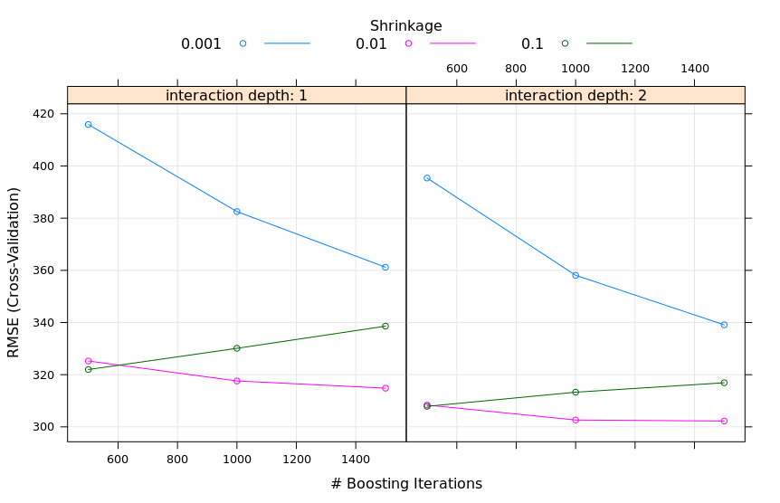
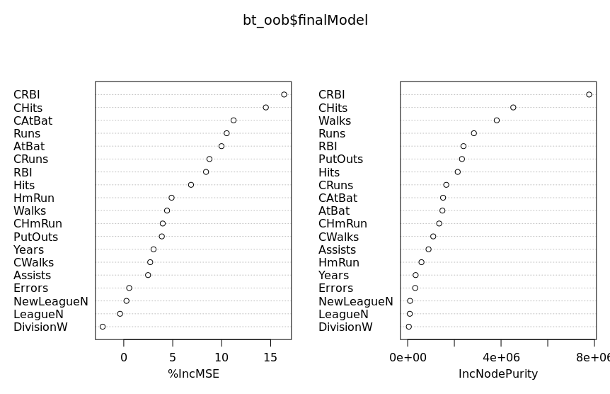

## Q5

1. The random forest model chose an mtry value of 6.

2. Plot:

3. Plot: 

4. Plot:

5. According to the random forest model, the three most important predictors are
CHits, CAtBat, and CRBI. This makes sense because these are the "flashy" metrics
that fans are most likely to use to determine their favourite players, and the
fact that these are career-based metrics means that they naturally include
seniority, which one would expect to play a big role in salary. Hits measure
accuracy, times at bat roughly measure how much the team trusts the player (as
the more they trust them, the higher up they'll tend to be in the batting order),
and runs batted in is a good wholistic measure of a player's contribution to their
team, as the whole point of baseball is to score more runs than the other team.

6. According to the boosted tree model, the three most important predictors are
CRBI, CHits, and CAtBat. This model agrees with the random forest model about
which three predictors are most important - this is unsurprising as both models
scored nearly identical RMSE scores in the test data. The justification for why
these particular predictors are given high importance is the same as for the
previous question.
