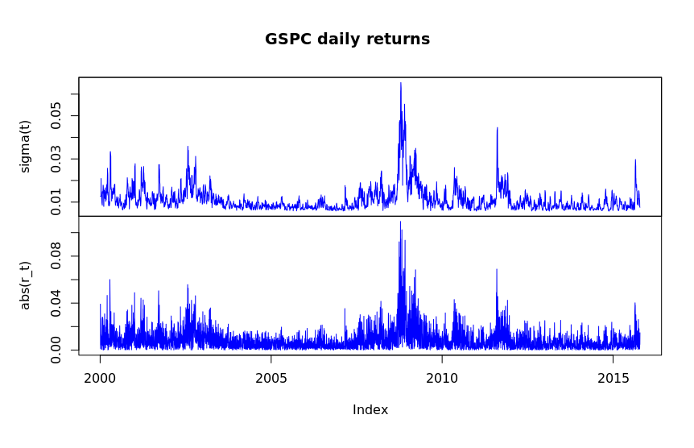
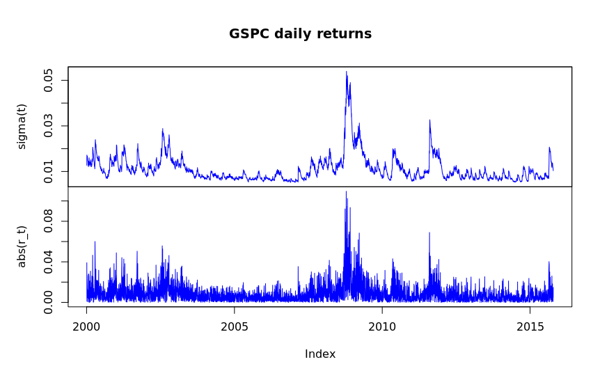
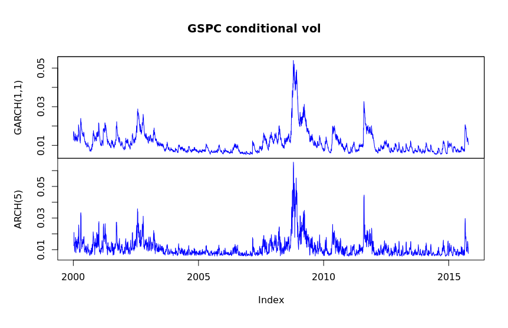
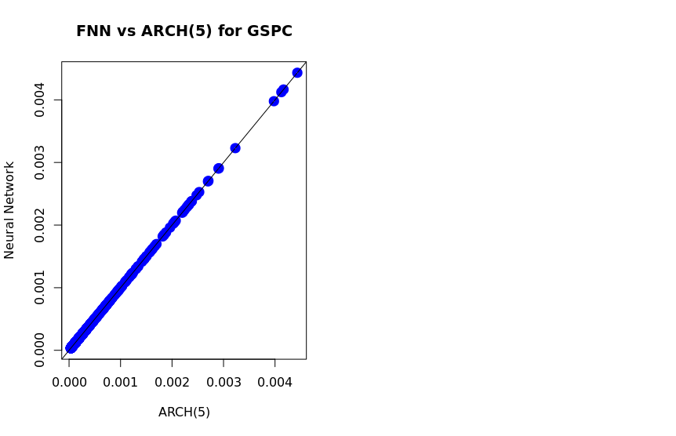
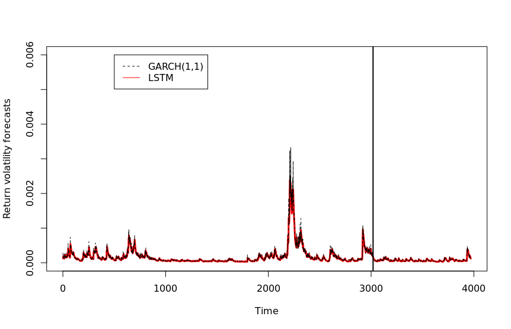

# A5

## Q1

1. The sum of the ARCH coefficient estimates is `0.8024`.

2. The estimate of the unconditional volatility is `0.01303`, 
and the sample standard deviation of the returns is `0.01271`.
These values are very close, suggesting that the estimate is
very accurate, as it closely aligns with the sample's SD.

3. The sum of the GARCH(1,1) coefficient estimates is `0.987`.

4. The GARCH(1,1) estimates look very similar to those of the
ARCH model, with the notable difference that the GARCH(1,1)
model is much smoother. This is especially valuable because
it means that models using this to trade would incur far
fewer transaction costs.

5. The estimate of the unconditional volatility of the returns
for the GARCH(1,1) model is `0.01178`. This is lower than both
the ARCH and sample SD values. Thus, it suggests that the GARCH(1,1)
model is strongly representative of the underlying random
variable/process.

## Q2

1. The models fit exceptionally well; as shown in part B, the models have settled on identical
parameters.

2. Estimated parameters:

| Model | Param 1 | Param 2 | Param 3 | Param 4 | Param 5 | Param 6 |
|---|---|---|---|---|---|---|
| ARCH(5) | 3.353e-05 | 6.219e-02 | 2.275e-01 | 2.118e-01 | 1.853e-01 | 1.525e-01 |
| FNN     | 3.353e-05 | 6.219e-02 | 2.275e-01 | 2.118e-01 | 1.853e-01 | 1.525e-01 |

Both models have settled on identical parameters.

## Q3

1.

2. 

| Model | Param 1 | Param 2 | Param 3 | Param 2 + Param 3 |
|---|---|---|---|---|
| GARCH(1,1) | 1.741e-06 | 9.397e-02 | 8.936e-01 | 0.9875 |
| RNN | 1.741e-06 | 9.397e-02 | 8.936e-01 | 0.9875 |

## Q4

1. Done by provided code.

2. Done by provided code.

3. No such question?

4. The performance of the two models is very, very similar. It looks like
the LSTM doesn't have volatility peaks as high as GARCH, and LSTM appears
to be a little slower to make adjustments than GARCH. Otherwise, the models
perform identically.

5. The first gate, `ot`, seems to be a score function that tracks whether or not
the model made the correct prediction in the next timestep, with larger mistakes
resulting in larger drops in score. It may also be a confidence metric.
The second gate, `ft`, appears to be tracking stock price. The third gate, `it`, 
looks like it might be measuring some sort of sentiment estimate like volume, as
it also has some peaks during the 2008/2009 financial crisis time.

6. 

| Model | Sum of Absolute Deviation | Sum of Squared Errors | R^2 | Akaike Information Criterion |
|---|---|---|---|---|
| GARCH | 0.05885 | 1.023e-05 | 0.3434 | -7425 |
| LSTM | 0.06379 | 1.219e-05 | 0.2174 | -7403 |

Based on the sum of squared errors, it looks like GARCH performed a little better
than the LSTM. It also had a lower sum of absolute deviation, but they both had
quite low R^2 values. Additionally, their AIC scores are very similar, but by
the definition of AIC, the GARCH model is significantly better. This aligns with
the other metrics we've seen.

## Q5

Based on this homework assignment, we've seen that LSTMs and RNNs are effective,
if not perfect, models for forecasting volatility of financial assets. GARCH is
designed for estimating volatility of time series, and both the LSTM and RNN
had close (but slightly worse) performance. However, the LSTM and RNN might be
able to use additional data points more effectively than GARCH. Lastly, the
markets are not a closed system - as "hype" and other factors can play
as big a role as fundamentals in terms of pricing - therefore, some amount of
error is to be expected.
