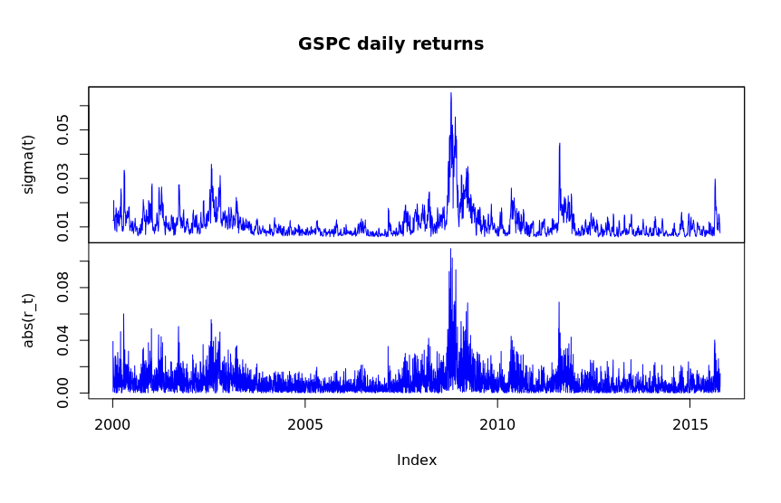
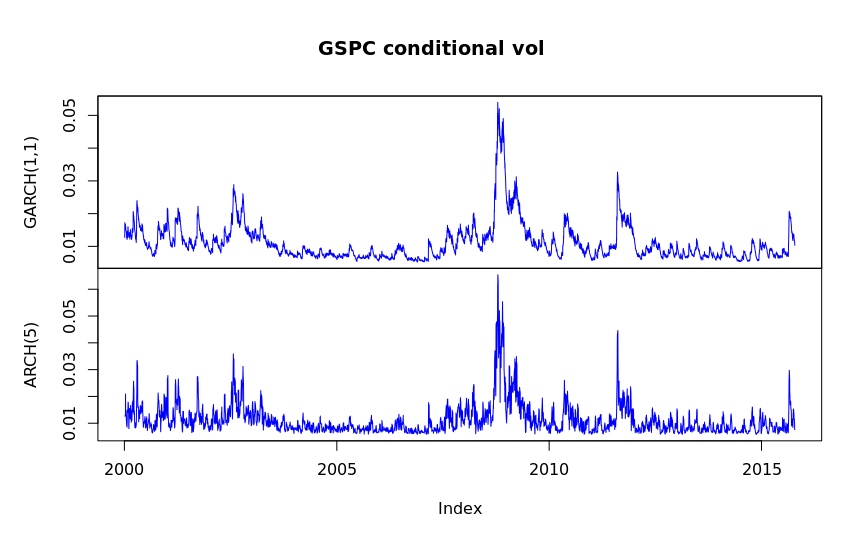

## Q1

1. The sum of the ARCH coefficient estimates is `0.8024`.

2. The estimate of the unconditional volatility is `0.01303`, 
and the sample standard deviation of the returns is `0.01271`.
These values are very close, suggesting that the estimate is
very accurate, as it closely aligns with the sample's SD.

3. The sum of the GARCH(1,1) coefficient estimates is `0.987`.

4. The GARCH(1,1) estimates look very similar to those of the
ARCH model, with the notable difference that the GARCH(1,1)
model is much smoother. This is especially valuable because
it means that models using this to trade would incur far
fewer transaction costs.

5. The estimate of the unconditional volatility of the returns
for the GARCH(1,1) model is `0.01178`. This is lower than both
the ARCH and sample SD values. Thus, it suggests that the GARCH(1,1)
model is strongly representative of the underlying random
variable/process.
