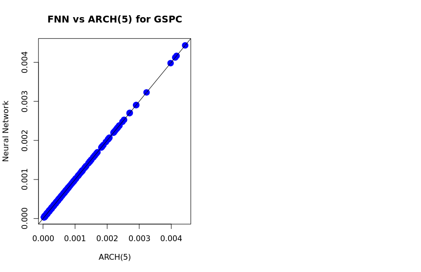

## Q2

1. The models fit exceptionally well; as shown in part B, the models have settled on identical
parameters.

2. Estimated parameters:

| Model | Param 1 | Param 2 | Param 3 | Param 4 | Param 5 | Param 6 |
|---|---|---|---|---|---|---|
| ARCH(5) | 3.353e-05 | 6.219e-02 | 2.275e-01 | 2.118e-01 | 1.853e-01 | 1.525e-01 |
| FNN     | 3.353e-05 | 6.219e-02 | 2.275e-01 | 2.118e-01 | 1.853e-01 | 1.525e-01 |

Both models have settled on identical parameters.
