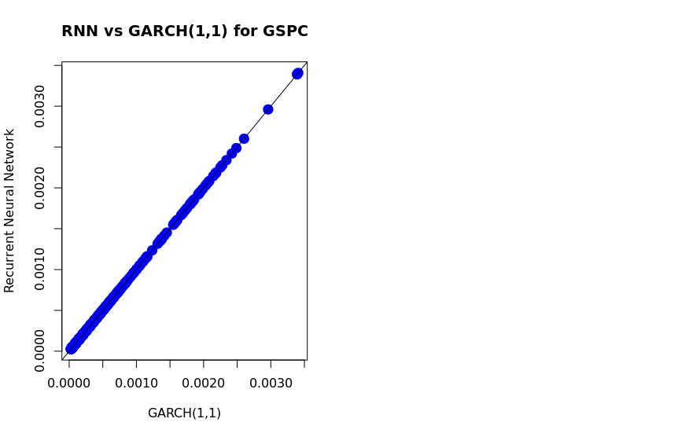

## Q3

1.

2. 

| Model | Param 1 | Param 2 | Param 3 | Param 2 + Param 3 |
|---|---|---|---|---|
| GARCH(1,1) | 1.741e-06 | 9.397e-02 | 8.936e-01 | 0.9875 |
| RNN | 1.741e-06 | 9.397e-02 | 8.936e-01 | 0.9875 |
