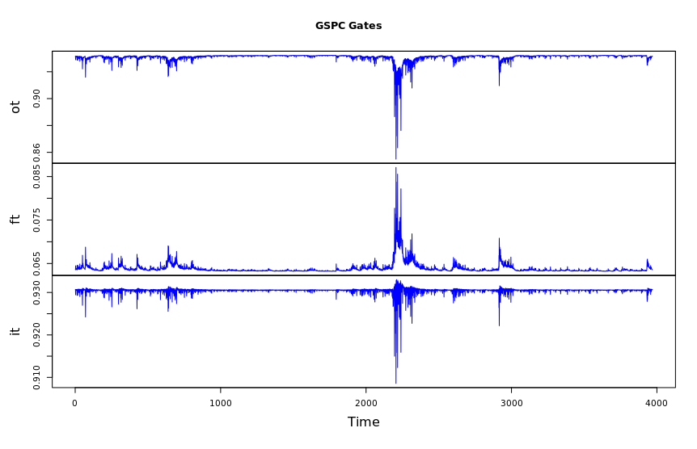

## Q4

1. Done by provided code.

2. Done by provided code.

3. No such question?

4. The performance of the two models is very, very similar. It looks like
the LSTM doesn't have volatility peaks as high as GARCH, and LSTM appears
to be a little slower to make adjustments than GARCH. Otherwise, the models
perform identically.

5. The first gate, `ot`, seems to be a score function that tracks whether or not
the model made the correct prediction in the next timestep, with larger mistakes
resulting in larger drops in score. It may also be a confidence metric.
The second gate, `ft`, appears to be tracking stock price. The third gate, `it`, 
looks like it might be measuring some sort of sentiment estimate like volume, as
it also has some peaks during the 2008/2009 financial crisis time.

6. 

| Model | Sum of Absolute Deviation | Sum of Squared Errors | R^2 | Akaike Information Criterion |
|---|---|---|---|---|
| GARCH | 0.05885 | 1.023e-05 | 0.3434 | -7425 |
| LSTM | 0.06379 | 1.219e-05 | 0.2174 | -7403 |

Based on the sum of squared errors, it looks like GARCH performed a little better
than the LSTM. It also had a lower sum of absolute deviation, but they both had
quite low R^2 values. Additionally, their AIC scores are very similar, but by
the definition of AIC, the GARCH model is significantly better. This aligns with
the other metrics we've seen.
