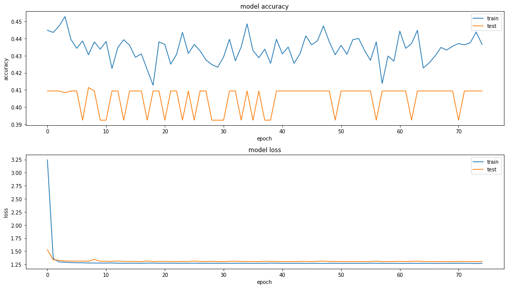
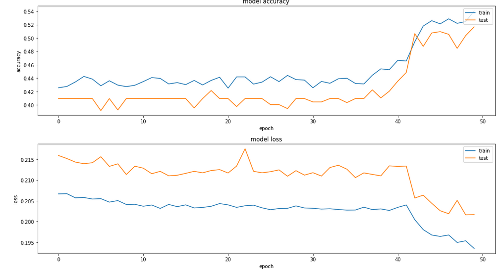
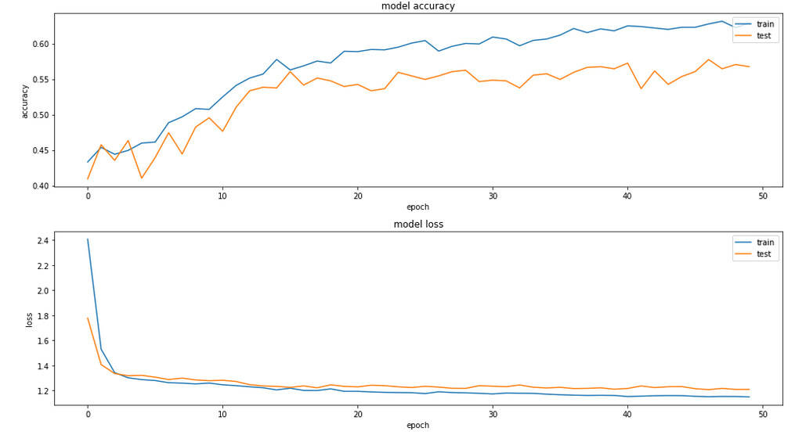
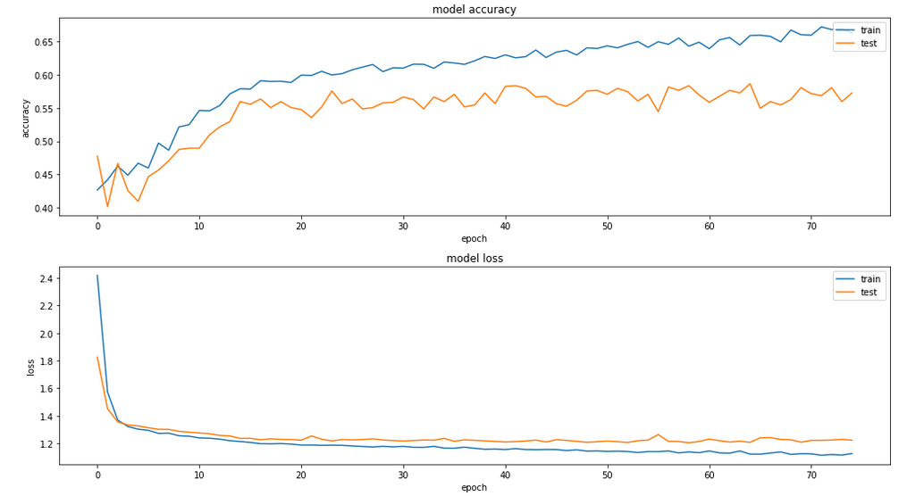

# A Simple But Effective LSTM for FX Buy/Sell/Hold Decision-Making

## Abstract

In this paper we work on developing a minimal, but 
successful, LSTM model that makes buy/sell/hold predictions
for foreign exchange (FX) markets. We achieve a 57.62% accuracy
on our test data, with a model trained in under 5 minutes on a
single CPU, and in under 500 MB of RAM.

## Research Question

We wanted to explore what the simplest model we could make
that made buy/sell predictions for foreign exchange. Exploring
FX markets is valuable not only because they are global and
run continuously (unlike equities), but also because they are
less susceptible to "hype" and market sentiment, and thus more
predictable. 

## Variables and Measures

We used OHLC (open, high, low, close) data for EUR:USD from
Jan 2, 2002 to Mar 29, 2021 as our primary data set. We
further augmented the data by providing skew, kurtosis, and
standard deviation measures for each of the initial 4 columns.
Therefore, in total we had 16 features that we trained on. We
also used a window size of 4, meaning that for each prediction,
the model also had access to the past 3 days' data (for a total
of 4 days worth of data).

This data was sourced from Alphavantage, and is available by
using their demo API key (although API keys are free).

Our response was a class variable, representing either buy, sell,
or hold. This response was generated by us, using a simple
algorithm that assumed perfect future knowledge. It worked from
the present back into the past, and for each day determined if
the price increased, decreased, or didn't move meaningfully from
the previous day. Our threshold for "inconclusive change" is
a hyperparameter that could be tuned, but we only tried
using 10 basis points (0.1%), as that worked well enough.

As our goal was to find the simplest "effective" model, we
intentionally did not use a particularly sophisticated
algorithm to create our labels, and this is one possible
aspect future works could study.

## The AI Application

The goal of the application was to correctly predict the
buy/sell/hold decision that our algorithm had previously determined.
We note that one benefit of this goal choice is that future
implementations can choose to modify the goal output as they wish,
and the rest of the architecture should be reusable with no
modification. In some cases, transfer learning may also be possible,
though due to the nature of how simple the base model is, this may
not be a meaningful advantage.

Our model was a sequential LSTM (Long-Short Term Memory) model,
meaning that the data flowed through each layer of the LSTM in
sequence (there were no skips, or forks, or multiple paths for
the gradient to flow). This is in line with our goal of building
the simplest effective model. We then have two dense layers with 
drop out, followed by a smaller dense layer with a softmax, to 
determine our output classes.

All of our layers used ReLU (rectified linear units) as our
activation function (though we also tried sigmoids and leaky
relus), as well as a L2 regularizers. Our optimizer is Adam,
and our best results were with squared hinge loss, though
we also tried mean squared error, linear hinge loss, and binary
crossentropy. We found that the squared hinge loss provided a
huge spike in performance, which we believe is due to the model
being much more strongly encouraged to make a decision.

## Experimental Methodology

We used Keras (specifically, Tensorflow version 2.4.1) as the
abstraction layer for our model, as well as the
[MyBinder](https://mybinder.org/) platform for running our
code as Jupyter notebooks online. This made it both easier to
share final results, as well as helped keep us from producing
models that are too complex, as the platform limits users to
only 2 GB of RAM. We never came close to hitting that limit.

Our model was created using the following code:

```python
# NB: Combined from multiple cells
WINDOW_SIZE = 4
NUM_INPUTS = 16

model = Sequential()
model.add(LSTM(80, activation='relu', kernel_regularizer='l2', input_shape=(NUM_INPUTS,WINDOW_SIZE)))
model.add(Dense(100, activation='relu', kernel_regularizer='l2'))
model.add(Dropout(0.5))
model.add(Dense(100, activation='relu', kernel_regularizer='l2'))
model.add(Dropout(0.5))
model.add(Dense(3, activation='relu', kernel_regularizer='l2'))
model.add(Softmax())
model.compile(optimizer='adam', loss=SquaredHinge(), metrics=["accuracy"])
```

which produced a model with the following description:

| Layer (type)                | Output Shape             | Param #   |
| ---|---|---|
| lstm (LSTM)                 | (None, 80)               | 27200     |
| dense (Dense)               | (None, 100)              | 8100      |
| dropout (Dropout)           | (None, 100)              | 0         |
| dense_1 (Dense)             | (None, 100)              | 10100     |
| dropout_1 (Dropout)         | (None, 100)              | 0         |
| dense_2 (Dense)             | (None, 3)                | 303       |
| softmax (Softmax)           | (None, 3)                | 0         |

> Total params: 45,703
>
> Trainable params: 45,703
>
> Non-trainable params: 0

To access and run the code yourself on MyBinder, use the following link:
https://mybinder.org/v2/gh/vabresto/afm423/HEAD?filepath=proj%2Fmain_experiment.ipynb

We used a 20% split as our validation data, and the remaining 80% was used for
training. We note here that we used Keras' automatic test/train split feature,
which removed the last 20% of the data to be used for testing, and then
shuffled the training data. It is inclear how important this shuffling is,
but we believe that it provided better stability in training.

## Results and Discussion

We struggled to create an effective model for quite a while, with most of our
results looking similarly to the following image:



The training results were all over the place, the test data was essentially flat,
and the loss wasn't changing.

After some tweaking, we tried changing the second dense layer from also using
a softmax activation function back to using ReLU, and we saw that although
results for the first 40 epochs didn't change much, there was a significant
jump in performance afterwards:



Our next breakthrough after that was observing that the model was predicting
values very close to the realy distribution of labels in our data set, up
to 4 significant digits. Hence, we tried using a hinge loss to encourage it
to be much more decisive. While linear hinge loss didn't improve performance
much, squared hinge loss did, as can be seen here:



Lastly, we tried increasing the number of epochs from 50 to 75, for our
final result:



Although the training data set accuracy does seem to continue improving,
we felt confident at this point in saying that clearly a plateau had
been reached for the test set, and further training was most likely to
only lead to overfitting.

In this particular run, we were able to achieve a final test accuracy of
57.26%.

We had several noteworthy observations while conducting this research.

First, we originally tried predicting the next day's "open" price,
using both just previous opens, and the entire OHLC set, but found
that there was very little predictive power in just that data. No
matter how complex we made the model (within our constraints), we
could not produce results that were much better than guessing the
underlying distribution. 

Second, we found that introducing the skew, kurtosis, and standard
deviation measures, similarly to Stankeviciene et al. (2014),
significantly improved the effectiveness of our model - as a
corollary of the previous point, we believe it would not have
been possible to achieve a successful result without doing so.

We tried including just the open and these measures for the open,
which produced a slight positive signal, but it was not very 
successful. We did not try any other combinations of OHLC and
statistical descriptors of the metrics.

Consequently, we believe that including the descriptors allowed
the model to refine (ex. better sample) the underlying distribution
that it already demonstrated it learned.

## Related Work

Our project is in line with our original proposal,
therefore, the reader is referred to our survey of
the literature from the previous report.

## Conclusions

We have shown that a sequential LSTM model with only ~45,000 parameters
can be trained in under 5 minutes on free hardware that can successfully
predict buy/sell/hold decisions for EUR:USD foreign exchange markets with
a 57.26% accuracy over a roughly 18 month test period.

We would not recommend immediately implementing this model unchanged
for live trading, as there are several additional concerns that need to
be addressed. First of all, this model does not account for any
transaction costs, liquidity limitations, portfolio limits (maximum 
holding or short sell position sizes), or have any other risk controls.
Additionally, we did not do any investigations into drawdowns, portfolio
risks, legal compliance, explainability, or any other highly critical
considerations.

However, we believe this lays the groundwork for further research, as
there are several aspects that can be further developed, for example:
* improving the label-generating algorithm
* further tweaking hyperparameters
* conducting risk analysis on the model and introducing transaction costs
* generalizing the model to other FX pairs
* trying other techniques like training ensembles to further increase accuracy

and many others.
